# WebApplication for Event Registration

## AIM:
To create a UX design and develop a web application for event registration.
## DESIGN STEPS:
### Step 1: 
Requirement collection.
### Step 2:
Creating the layout using HTML and CSS.
### Step 3:
Updating the sample content.
### Step 4:
Choose the appropriate style and color scheme.
### Step 5:
Validate the layout in various browsers.
### Step 6:
Validate the HTML code.
### Step 7:
Create a database model and migrate the database.
### Step 8:
Retrieve data from database and display it in a webpage.
### Step 9:
Publish the website in the given URL.
### Step 10:
create a UX design for the web application.
### Step 11:
Choosing the suitable color scheme
### Step 12:
Creating artboards for individual pages
### Step 13:
Designing layout for individual pages
### Step 14:
Creating links and linking it with artboards
### Step 15:
Preview the prototype.

## DESIGN SCREENS:
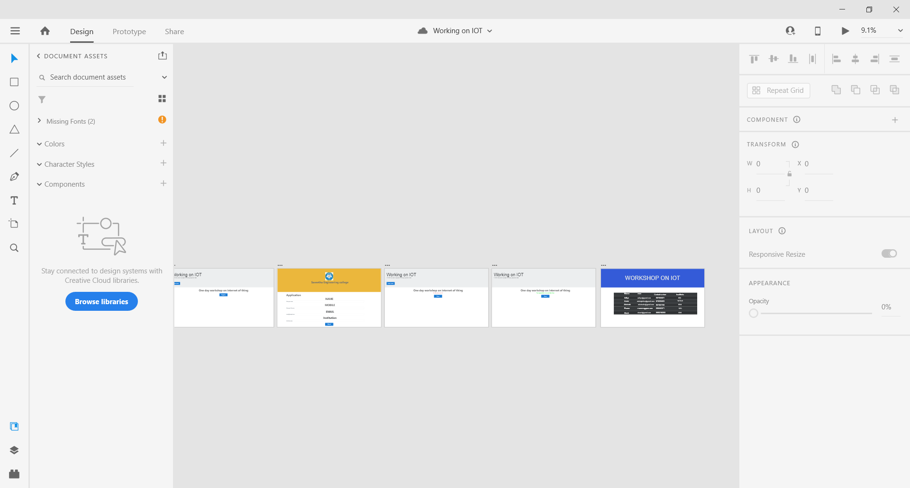

## WIREFRAME:
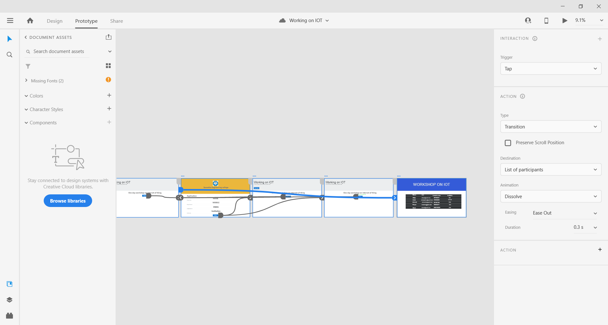

## PROTOTYPE:

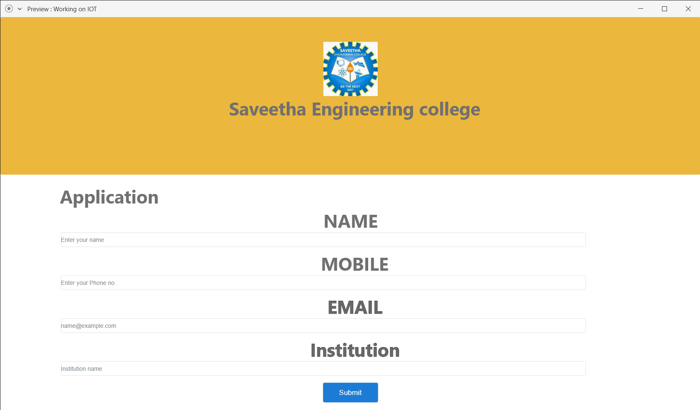
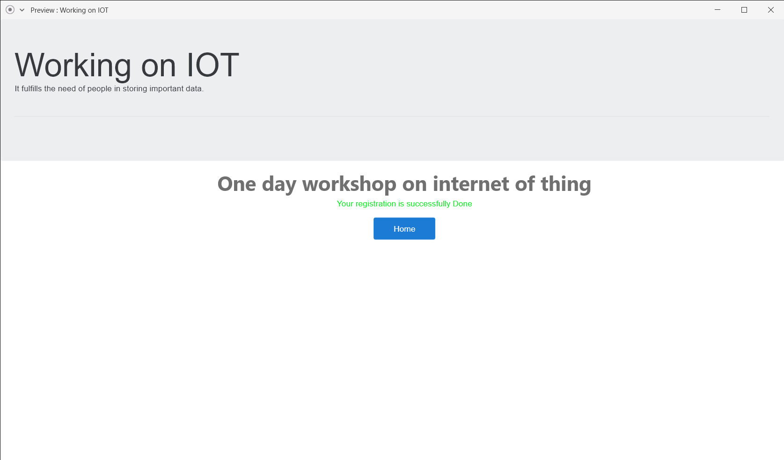
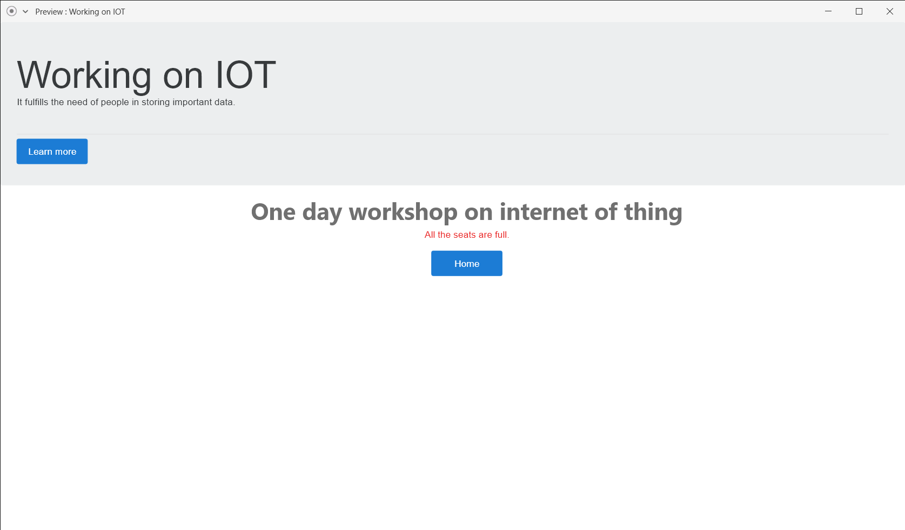
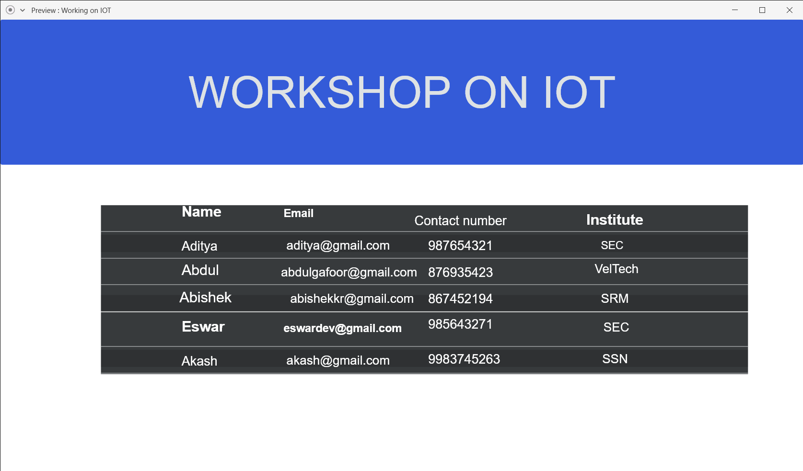

## PROGRAM:

### home.html
~~~
<!doctype html>
<html lang="en">
  <head>
    <!-- Required meta tags -->
    <meta charset="utf-8">
    <meta name="viewport" content="width=device-width, initial-scale=1, shrink-to-fit=no">

    <!-- Bootstrap CSS -->
    <link rel="stylesheet" href="https://maxcdn.bootstrapcdn.com/bootstrap/4.0.0/css/bootstrap.min.css" integrity="sha384-Gn5384xqQ1aoWXA+058RXPxPg6fy4IWvTNh0E263XmFcJlSAwiGgFAW/dAiS6JXm" crossorigin="anonymous">

    <title>Hello, world!</title>
  </head>
  <body>
    

        

            <h1 class="display-4">Working on IOT</h1>
            
It fulfills the need of people in storing important data. 

            

            

            <a class="btn btn-primary btn-lg" href="#" role="button">Learn more</a>
            

        

    

    

        

            

                <h1>One day workshop on internet of thing</h1>
            

        

        

            

                <a href="/register/" class="btn btn-primary btn-lg" role="button">Register</a>
            

        

    

    <!-- Optional JavaScript -->
    <!-- jQuery first, then Popper.js, then Bootstrap JS -->
    
    
    
  </body>
</html>
~~~

### register.html
~~~
<!doctype html>
<html lang="en">

<head>
    <!-- Required meta tags --> 
    <meta charset="utf-8">
    <meta name="viewport" content="width=device-width, initial-scale=1, shrink-to-fit=no">

    <!-- Bootstrap CSS -->
    <link rel="stylesheet" href="https://maxcdn.bootstrapcdn.com/bootstrap/4.0.0/css/bootstrap.min.css"
        integrity="sha384-Gn5384xqQ1aoWXA+058RXPxPg6fy4IWvTNh0E263XmFcJlSAwiGgFAW/dAiS6JXm" crossorigin="anonymous">

     <title>Event Register</title>
  </head>
  <body>
      
      
      

        

            
            
            <h1>Saveetha Engineering college</h1>
        

      

    

        

            

                <h1>Application</h1>
            

        
 
       <form action="/register/" method="POST">
        
        

        

            <label for="username">NAME</label>
            <input type="text" class="form-control" id="username" name="username" placeholder="Enter your name">
        

        

            <label for="phone">MOBILE</label>
            <input type="text" class="form-control" id="phone" name="phone" placeholder="Enter your Phone.no">
        

        

            <label for="email">EMAIL</label>
            <input type="email" class="form-control" id="email" name="email" placeholder="name@example.com">
        

        

            <label for="institution">institution</label>
            <input type="text" class="form-control" id="institution" name="institution" placeholder="Institution name">
        

        

              
              <input type="submit" class="btn btn-primary btn-lg"  aria-pressed="true"></a>
              
        

    

    </form>

    

    

    <!-- Optional JavaScript -->
    <!-- jQuery first, then Popper.js, then Bootstrap JS -->
    
    
    
</body>

</html>
~~~

### listofparticipants.html
~~~
<!doctype html>
<html lang="en">

<head>
    <!-- Required meta tags --> 
    <meta charset="utf-8">
    <meta name="viewport" content="width=device-width, initial-scale=1, shrink-to-fit=no">

    <!-- Bootstrap CSS -->
    <link rel="stylesheet" href="https://maxcdn.bootstrapcdn.com/bootstrap/4.0.0/css/bootstrap.min.css"
        integrity="sha384-Gn5384xqQ1aoWXA+058RXPxPg6fy4IWvTNh0E263XmFcJlSAwiGgFAW/dAiS6JXm" crossorigin="anonymous">

     <title>Event Register</title>
  </head>
  <body>
      
      
      

        

            
            
            <h1>Saveetha Engineering college</h1>
        

      

    

        

            

                <h1>Application</h1>
            

        
 
       <form action="/register/" method="POST">
        
        

        

            <label for="username">NAME</label>
            <input type="text" class="form-control" id="username" name="username" placeholder="Enter your name">
        

        

            <label for="phone">MOBILE</label>
            <input type="text" class="form-control" id="phone" name="phone" placeholder="Enter your Phone.no">
        

        

            <label for="email">EMAIL</label>
            <input type="email" class="form-control" id="email" name="email" placeholder="name@example.com">
        

        

            <label for="institution">institution</label>
            <input type="text" class="form-control" id="institution" name="institution" placeholder="Institution name">
        

        

              
              <input type="submit" class="btn btn-primary btn-lg"  aria-pressed="true"></a>
              
        

    

    </form>

    

    

    <!-- Optional JavaScript -->
    <!-- jQuery first, then Popper.js, then Bootstrap JS -->
    
    
    
</body>

</html>
~~~

### views.py
~~~
from django.shortcuts import render
from .models import participant

# Create your views here.
def home(request):
    context = {}
    return render(request, 'events/home.html', context)

def register(request):
    context = {}
    if request.method == 'POST':
       p1 = participant()
       p1.username = request.POST.get('username', '-')
       p1.email = request.POST.get('email', '-')
       p1.phone = request.POST.get('phone', '000')
       p1.institution = request.POST.get('institution', '-')

       if len(participant.objects.all()) >= 5:
           return render(request,'events/failed.html', context)
       else:
            p1.save()
            return render(request,'events/success.html', context)

    if request.method == 'GET':
        context['username'] = ''
        context['email'] = ''
        context['phone'] = ''
        context['institution'] = ''
    return render(request, 'events/register.html', context)

def listofparticipants(request):
    context = {}

    context['participant'] = participant.objects.all()
    return render(request, 'events/listofparticipants.html', context)

~~~

## OUTPUT:
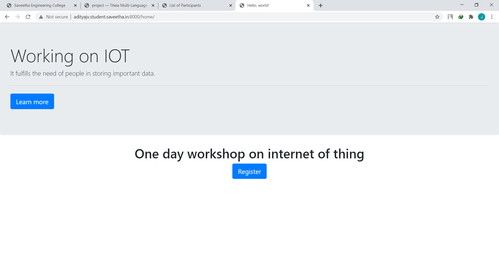
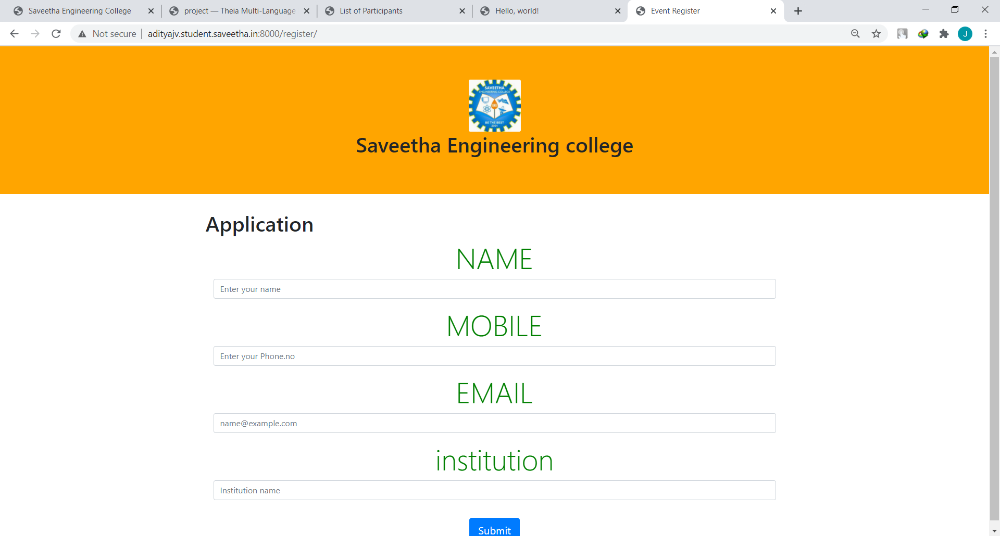
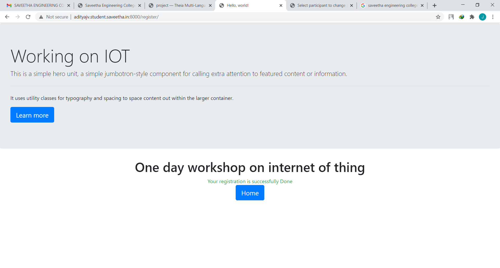
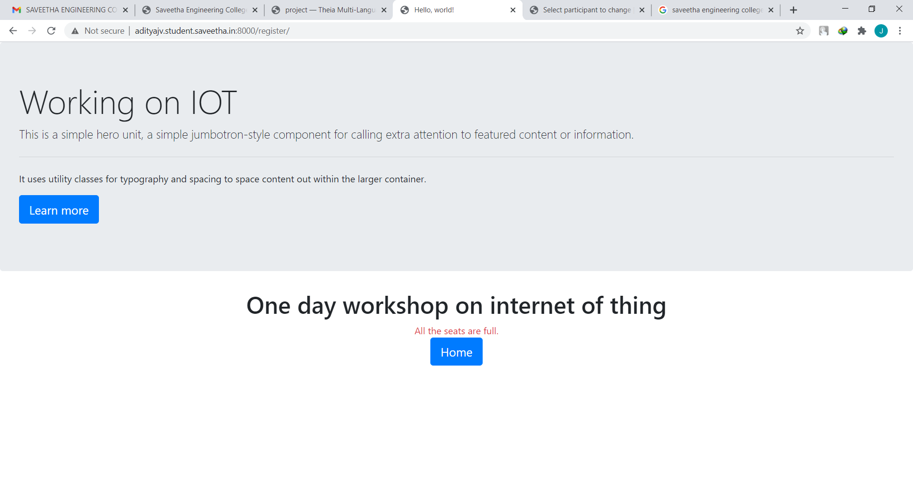

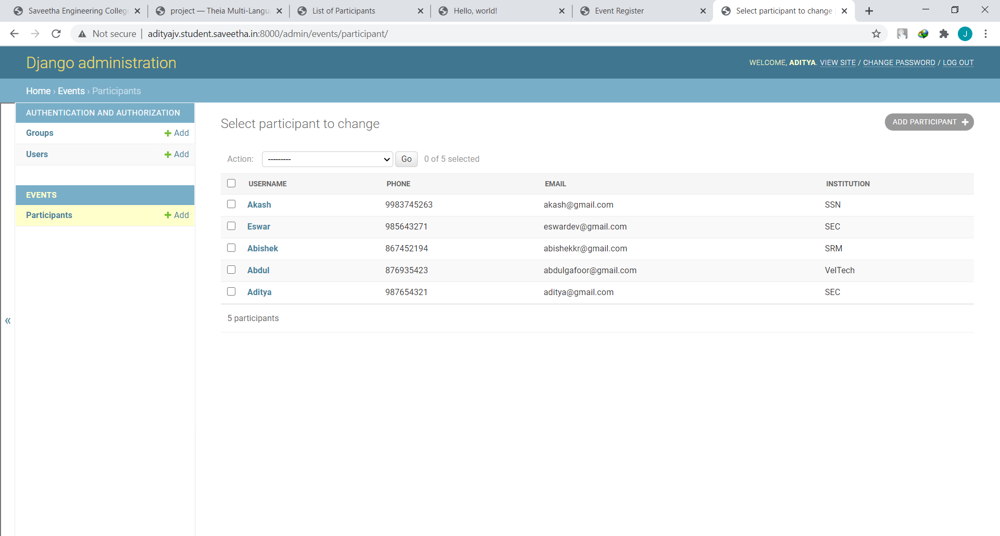

## RESULT:
Thus, a UX design and web application for event registration has been developed and is hoisted in the URL http://adityajv.student.saveetha.in:8000/home/ and http://adityajv.student.saveetha.in:8000/listofparticipants/ . GitHub Repo URL is https://github.com/adityajv2310/eventregistration .